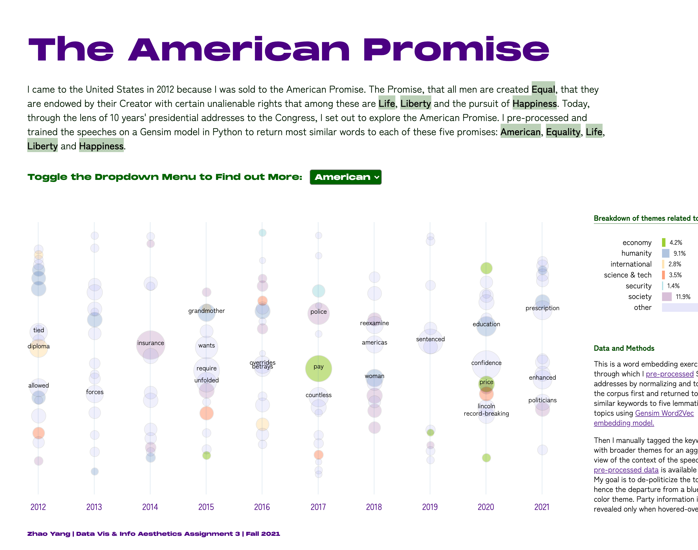

##  Visualize Textual and Qualitative Data using State of the Union Addresses

### Summary
This is a weekly assignment of visualizing textual data at the Data Vis & Info Aesthetics class. I touched it up and fixed some remaining bugs after submitting the assignment.

### Process
I chose to analyze the past 10 years State of the Union addresses to Congress. As a foreigner, I chose to de-politicize my analysis and focus on American values from an outsider's perspective. I wanted to compare each speech to the Declaration of Independence, most particularly, how the keywords/American values of "American", "Equality", "Life", "Liberty" and "Happiness" were reflected in these speeches. 

### Text Processing
I pre-processed the corpus using normalization and tokenization methods and then I used the [Gensim Word2Vec model](https://tedboy.github.io/nlps/generated/generated/gensim.models.Word2Vec.most_similar.html) to train and output top most similar words related to the abovementioned keywards in each speech.

For details of text preprocessing, see [here](https://github.com/muonius/msdv-state-of-the-union/blob/master/data/processing.py). After that, I mannually combed through the returned keywords and when I noticed where the keywords made little sense, I went back to the corpus and made revisions to my pre-processing procedures to improve the models.

After gathering the improved keywords, I mannually tagged them with seven major themes such as "economy", "humanity" or "science & tech" to have a more aggregated view on them.

### Visualization
I chose `d3.js` bubble chart for my visualization. The size of the bubbles indicates the `similarity score`. However, in my opinion, the `similarity score` values don't hold significant value so I did not sort or arrange the bubble chart based on `similarity score` values, rather, I have them somewhat randomized.

### Outcome
I discovered that the model has a better outcome when it comes to Trump's speeches. They seem to be more digestable and relatable even from a model output perspective. Trump was the only one who mentioned "happy" or "happiness" in the past 10 years' SOTU addresses. No wonder half of this country voted for him.

### Limitations
This is a weekly assignment and I was very constrained by time. Should time allow, I would have spent more time applying more sophisticated methods in my text pre-processing such as incorporating lemmatization on the training corpus. The `d3.js` transition animation or the lack of it is also a bit buggy.
